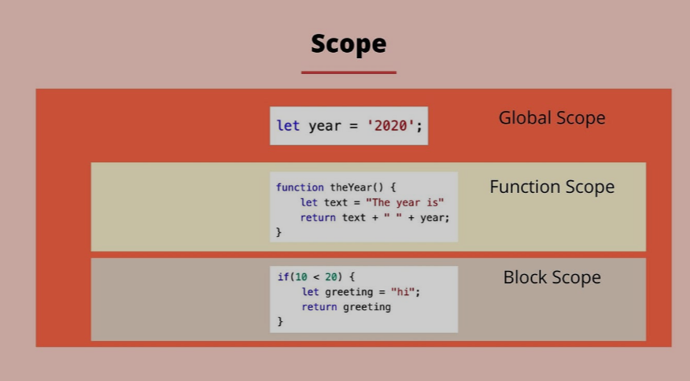
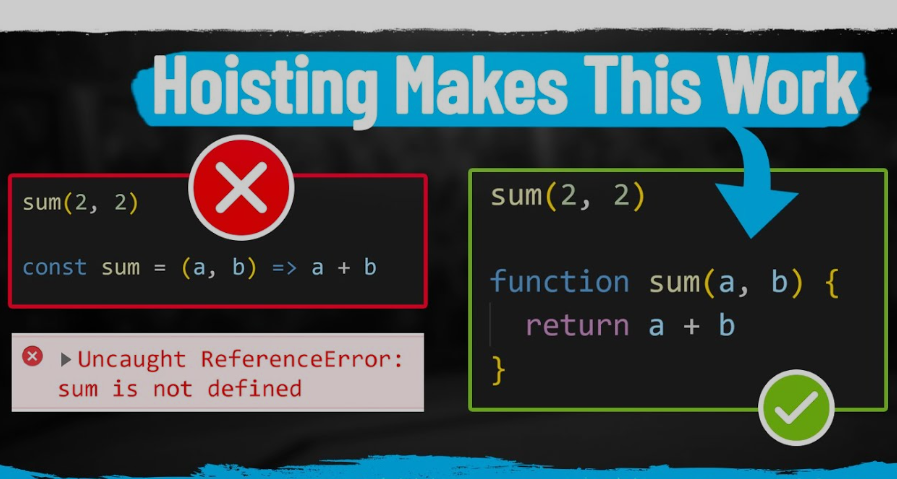

# Table Of Contents

# 1 Scope 

Область видимости (scope) — ограниченный участок кода, структурная единица, внутри которой доступна объявленная переменная.
___

# 2 Hoisting

Hoisting – это уникальная особенность JavaScript, которая позволяет вам обращаться к переменным и функциям до того, как они были объявлены в коде. Это может звучать немного магически, но на самом деле это результат того, как JavaScript обрабатывает ваш код перед его выполнением.
___

# 3 TDZ Temporary dead Zone

___

___

